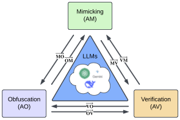

<div align="center" width="600">


</div>

# Unraveling the Interwoven Roles of Large Language Models in Authorship Privacy: Verification, Obfuscation, and Mimicking
This is the implementation of the paper: Unraveling the Interwoven Roles of Large Language Models in Authorship Privacy: Verification, Obfuscation, and Mimicking. In this work, we introduce a unified framework for studying how large language models (LLMs) engage with three interrelated dimensions of authorship: obfuscation (hiding identity), mimicking (imitating style), and verification (detecting authenticity).

### 📢 Updates

Our paper `Unraveling the Interwoven Roles of Large Language Models in Authorship Privacy: Verification, Obfuscation, and Mimicking` is now out on [arXiv](https://arxiv.org/abs/2505.14195).

### Quick Start
```bash
conda create --name AA python=3.11
conda install anaconda::pandas
conda install anaconda::scikit-learn
conda install conda-forge::openai
conda install conda-forge::tiktoken
conda install matplotlib
pip install datasets
pip3 install torch transformers pandas
pip3 install peft bitsandbytes accelerate
conda install -c conda-forge tensorflow-hub
pip install tf-keras
pip install gensim
```

### Data Preprocessing
Quora: 
- Randomly get 200 authors who have: profile and at least 50 writings
- Randomly get 50 samples and split train/val/test=40/5/5
- Define the template for the user_profile
- Use ChatGPT API to generate final user_profile with some specific attribute
- Run chatGPT to get synthesize dataset (let it run on the 40 train sample of train set)
- Evaluate on the dataset and synthesize dataset with bert, n-gram


### Citation

If our work aids your research, please consider citing it as follows:

```bibtex
@article{nguyen2025unraveling,
  title={Unraveling Interwoven Roles of Large Language Models in Authorship Privacy: Obfuscation, Mimicking, and Verification},
  author={Nguyen, Tuc and Hu, Yifan and Le, Thai},
  journal={EMNLP},
  year={2025}
}
